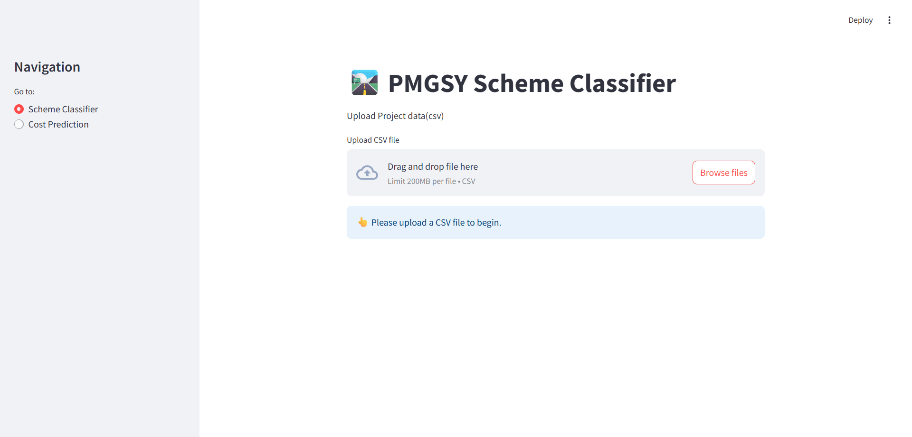

# 🛣️ PMGSY Scheme Classifier

A machine learning solution for classifying PMGSY schemes and estimating project funding based on physical and financial features.

---

## Project Overview

This project provides a robust classifier and cost estimator for PMGSY (Pradhan Mantri Gram Sadak Yojana) schemes, leveraging key physical and financial metrics associated with rural road development projects. The goal is to aid planners and analysts in identifying the most suitable PMGSY scheme for a given project and to estimate the required funding using state-of-the-art modeling and feature engineering.

---

## 📚 Table of Contents

- [🚀 Features](#-features)
- [🧠 Tech Stack](#-tech-stack)
- [⚙️ Setup Instructions](#️-setup-instructions)
- [📦 Project Structure](#-project-structure)
- [💬 Usage Example](#-usage-example)
- [🏗️ Architectural Choices](#️-architectural-choices)
- [📄 Example Inputs](#-example-inputs)
- [🔑 Sample Outputs](#-sample-outputs)

---

## 🚀 Features

- Classifies PMGSY scheme based on project features
- Estimates funding requirement for new projects
- Feature engineering for domain-specific metrics
- Streamlit web app for interactive predictions
- Modular Python package for training, inference, and deployment
- Exportable pipelines for production use

---

## 🧠 Tech Stack

| Layer          | Technology         |
|----------------|--------------------|
| Data Analysis  | Pandas, NumPy      |
| ML Framework   | scikit-learn       |
| ML Models      | XGBoost            |
| Web UI         | Streamlit          |
| Serialization  | joblib             |
| Notebooks      | Jupyter Notebook   |

---

## ⚙️ Setup Instructions

1. **Clone this repo**
   ```bash
   git clone https://github.com/abdulrahim860/PMGSY-Scheme-Classifier.git
   cd PMGSY-Scheme-Classifier
   ```

2. **Create a virtual environment**
   ```bash
   python -m venv pmgsy-env
   source pmgsy-env/bin/activate  # Linux/macOS
   pmgsy-env\Scripts\activate     # Windows
   ```

3. **Install dependencies**
   ```bash
   pip install -r requirements.txt
   ```

4. **Train and export models (optional)**
   - Run `notebooks/ML.ipynb` to train and export the classification/regression pipelines and label encoder.
   - Outputs: `pmgsy_xgb_clf_pipeline.pkl`, `pmgsy_xgb_reg_pipeline.pkl`, `scheme_label_encoder.pkl`

5. **Run the Streamlit app**
   ```bash
   streamlit run app.py
   ```

---

## 📦 Project Structure
```
PMGSY-Scheme-Classifier/
│
├── notebooks/
│   └── ML.ipynb                      # EDA, training, export scripts
│
├── pkl/
│   ├── pmgsy_xgb_clf_pipeline.pkl    # clf model pkl file
│   ├── pmgsy_xgb_reg_pipeline.pkl    # reg model pkl file
│   └── scheme_label_encoder.pkl      # label endoder pkl file
│ 
├── pmgsy/
│   ├── __init__.py
│   ├── feature_engineer.py           # Feature engineering classes
│   ├── preprocessing.py              # Preprocessing pipeline helpers
│   └──  model_utils.py               # Model loading/saving utilities
│   
├── app.py                            # Streamlit UI
│
├── requirements.txt
├── README.md
└── .gitignore
```
---

## 💬 Usage Example

**1. Upload your project CSV via the Streamlit UI.**

**2. Select "Scheme Classifier" or "Cost Prediction" from the sidebar.**

**3. View and download predictions as CSV.**

 

---

## 🏗️ Architectural Choices

- **Modular Python Package:** All feature engineering, preprocessing, and modeling logic is in `pmgsy/` for easy reuse and testing.
- **Single Pipeline Objects:** Both classifier and regressor are exported as scikit-learn pipelines for robust and reproducible inference.
- **Streamlit Frontend:** User-friendly, multi-page UI for batch prediction and download.
- **Jupyter Notebook Training:** Experiments and model development are performed in notebooks and exported for production use.

---

## 📄 Example Inputs

| STATE_NAME           | DISTRICT_NAME           | NO_OF_ROAD_WORK_SANCTIONED | LENGTH_OF_ROAD_WORK_SANCTIONED | ... | EXPENDITURE_OCCURED | ... |
|----------------------|------------------------|----------------------------|-------------------------------|-----|---------------------|-----|
| Andaman And Nicobar  | Nicobar                | 3                          | 2.969                         | ... | 1.1082              | ... |

---

## 🔑 Sample Outputs

| Predicted_Scheme | Estimated_Funding |
|------------------|------------------|
| PMGSY-I          | 1.39             |

---

## 📖 License

MIT License. See [LICENSE](LICENSE) for details.